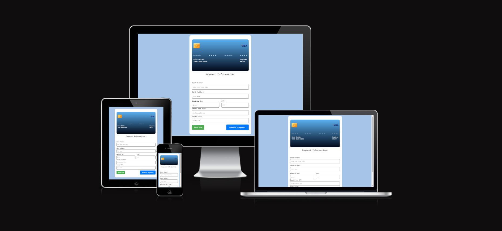

# 💳 Credit Card Form



🌐 Website Link: [Credit Card Form](https://purohit1999.github.io/p2/)

Welcome to the Credit Card Form project! This repository contains the source code and documentation for an interactive credit card form. This README provides an overview of the project, including its features, technologies used, testing, deployment, and more. 

## 📋 Table of Contents
1. [🔍 Project Overview](#project-overview)
2. [🎨 UX/UI Design](#uxui-design)
3. [🌈 Colour Scheme](#colour-scheme)
4. [🖋️ Typography](#typography)
5. [👤 User Stories](#user-stories)
6. [🖼️ Imagery](#imagery)
7. [📐 Wireframes](#wireframes)
8. [🗺️ 2D Skeleton Models](#2d-skeleton-models)
9. [🎭 Design Choices](#design-choices)
10. [✨ Features](#features)
11. [🛠️ Technologies Used](#technologies-used)
12. [🧪 Testing](#testing)
13. [📁 File Overview](#file-overview)
14. [🚀 Deployment](#deployment)
15. [🙏 Credit](#credit)
16. [📝 Content](#content)
17. [🖼️ Media](#media)
18. [👏 Acknowledgements](#acknowledgements)

## 🔍 Project Overview
This project is a dynamic and interactive credit card form built with HTML, CSS, and JavaScript. The Credit Card Form is designed to provide users with a visually appealing and user-friendly interface for entering their credit card details. It features real-time updates on a card preview, interactive animations, input validation, and formatting to ensure a smooth and intuitive user experience.
### Required Attributes
Added required to each input field to ensure that the form cannot be submitted without filling in all the fields.
Example: <input type="text" id="card-number" placeholder="1234 1234 1234 1234" maxlength="19" required />  
### Form Action and Method:

Added action="/process_payment" and method="POST" to the form element.
This specifies that the form data will be sent to the /process_payment endpoint using the POST method when the form is submitted.
These modifications ensure that users must fill in all required fields before submitting the form, and the form will be processed through the specified action and method.  
### Card Number Formatting:

Updated cardNumberInput to format as four groups of four digits.
Validates that the card number is 16 digits long.  
### Card Back Issue:

Fixed the issue of the card not flipping by ensuring CVV is correctly displayed on the back of the card.  
### Input Validation:

Added validation for card number, card holder name, and expiry date.
Alerts users to enter valid values if they do not match the required formats.  
### OTP Functionality:

Set the OTP to a fixed six-digit number "123456".
Added validation for OTP input during form submission.  
### Landing Page:

Added a home button to return to the main form.
Resets the form and hides the landing page when the home button is clicked.

## 🎨 UX/UI Design

### 🎯 Project Goals
The main goal of this project is to create a seamless and engaging user experience when entering credit card details. The design and interactivity are focused on ensuring that users feel comfortable and confident while providing sensitive payment information.

- **Interactivity**: Real-time feedback with a card preview that mirrors the user's inputs.
- **Usability**: Clear, labeled form fields that are easy to navigate.
- **Accessibility**: Designed to be usable by as many users as possible, including those with disabilities.
- **Responsiveness**: The layout adjusts and remains intuitive across different devices and screen sizes.

### 👥 User Goals
- Users should be able to **input credit card information** quickly and accurately.
- Visual cues and real-time updates help users understand the form's progress.
- **Input validation** ensures that users can only submit valid credit card details, reducing errors.
- The form provides an aesthetically pleasing experience while keeping functionality at the forefront.

### 👪 Parental Goals
Parents may be concerned about the safety and security of their credit card details. This project’s design focuses on:

- **Trust**: A clean, professional, and intuitive design that reassures users of the form's legitimacy.
- **Feedback**: Instant feedback on input errors to prevent mistakes.
- **Simple Navigation**: Straightforward design elements that help parents quickly fill out the form without unnecessary distractions.

### 💼 Developer and Business Goals
- **Reduce friction** in the payment process by offering an intuitive and smooth experience.
- **Improve conversion rates** by designing a user-friendly credit card form that encourages users to complete the transaction.
- **Showcase UI/UX expertise**: This project serves as a portfolio example for implementing modern and user-centered design principles.
- **Maintain security** by ensuring the design promotes user trust in inputting sensitive payment details.

## 🌈 Colour Scheme

The color scheme of the webpage has been thoughtfully designed to ensure both visual appeal and readability, maintaining a balance between contrast and harmony. The selected colors serve to enhance the user experience, focusing on usability, accessibility, and aesthetics.

### 🎨 Primary Colors:
- **#2c3e50 (Dark Blue)**: Used as the primary background and for key sections, this deep blue provides a strong foundation and professional feel, enhancing readability and creating a sleek modern look.
- **#ecf0f1 (Light Grey)**: A soft and neutral shade used for text backgrounds and secondary sections to offer high contrast against dark blue while maintaining a clean and minimal aesthetic.

### 🎨 Accent Colors:
- **#e74c3c (Red)**: Featured in buttons, alerts, and important interactive elements, this vibrant red draws attention to critical actions such as form submission, navigation links, and error prompts.
- **#3498db (Bright Blue)**: Used for links, buttons, and icons to create a friendly and energetic touch that encourages user interaction. This bright shade contrasts effectively with both the primary dark blue and light grey backgrounds.
  
### 🎨 Neutral Colors:
- **#ffffff (White)**: Utilized for text and key highlights against the dark background, ensuring maximum readability and clarity.
- **#95a5a6 (Muted Grey)**: Used in subtle dividers and secondary text to avoid overwhelming the user while maintaining a clean, minimal look for supplementary information.

### 🖼 Background and Text:
- **Background**: The predominant background color is **#2c3e50 (Dark Blue)**, giving the page a modern and calming feel. This helps important elements, like buttons and text, stand out.
- **Text**: The text color is primarily **#ffffff (White)** for optimal contrast against the dark background. This ensures the content remains readable and accessible across various devices and screen sizes.

### 🎯 Accessibility:
- The chosen color palette ensures sufficient contrast between text and background colors to meet accessibility standards, improving the page’s legibility for users with visual impairments or color blindness.
- Buttons and interactive elements are designed with distinct colors that stand out against the background, providing visual cues for easy navigation and interaction.

### 🌟 Visual Hierarchy:
- **Bright Blue (#3498db)** and **Red (#e74c3c)** are used sparingly to create focal points, guiding users to important actions or information.
- The strategic use of neutral tones like **#ecf0f1** helps balance the bright accents and ensures that the design feels cohesive without being overwhelming.

This thoughtful color scheme enhances both the aesthetic appeal and usability of the webpage, creating a pleasant experience for users.


## 🖋️ Typography

The typography for the webpage has been carefully selected to ensure readability, clarity, and a modern aesthetic. The combination of font styles, sizes, and weights contributes to an organized and user-friendly experience, enhancing both usability and visual hierarchy.

### 🅰️ Primary Font:
- **Font Family**: `Poppins`, sans-serif
  - **Description**: The "Poppins" font is a modern and clean sans-serif typeface. It offers excellent readability across various screen sizes and devices while adding a sleek, professional feel to the design.
  - **Use Case**: This font is used consistently across headings, subheadings, and body text to create a cohesive look and maintain a streamlined design.

### 🔡 Font Weights:
- **Bold (700)**: 
  - **Use Case**: Employed for primary headings (h1, h2) and important emphasis areas like buttons, to grab the user's attention and create clear visual hierarchy.
- **Semi-bold (600)**: 
  - **Use Case**: Used for subheadings (h3, h4) and smaller section titles to differentiate content blocks without overwhelming the user.
- **Regular (400)**: 
  - **Use Case**: Standard body text and paragraphs use the regular weight to ensure maximum readability for long-form content, such as descriptions or instructions.

### 🖋️ Font Sizes:
- **Headings**: 
  - **H1**: Large and bold to capture the user's attention and mark important sections.
  - **H2**: Slightly smaller than H1 but still bold, used for section headers to maintain content flow.
  - **H3 and H4**: Used for sub-sections or smaller groupings of content, balancing prominence and readability.
  
- **Body Text**: 
  - Set at a comfortable size to ensure readability across various devices, with sufficient spacing to enhance the user experience for longer reading sessions.

### ✨ Text Styling:
- **Uppercase Letters**: Applied to certain headings and buttons to create emphasis and differentiate important interactive elements.
- **Letter Spacing**: Slightly increased for uppercase text and buttons to improve readability and provide a more polished appearance.
- **Line Height**: Generous line height is applied to body text to improve readability and make the content easier to scan, particularly on mobile devices.

### 🎯 Hierarchy and Readability:
The typography choices follow a clear hierarchy to guide the user’s attention from the most important sections (headings) to secondary information (body text). Consistent use of font sizes and weights helps create a seamless and intuitive reading experience, enhancing the overall usability of the webpage.

### 🌐 Web Safe Fonts:
In case the primary font (`Poppins`) fails to load, the webpage falls back to a web-safe sans-serif font, ensuring that the content remains legible and visually appealing across all platforms and browsers.

### 🛠 Font Integration:
- **Google Fonts**: The Poppins font is integrated via Google Fonts, ensuring fast and reliable delivery of the font files.
  ```html
  <link href="https://fonts.googleapis.com/css2?family=Poppins:wght@400;600;700&display=swap" rel="stylesheet">


## 👤 User Stories

The following user stories represent the needs and goals of different users interacting with the credit card form webpage. These stories help guide the development of a user-centric interface and ensure that the design and functionality meet the expectations of the target audience.

### 🧑‍💻 As a User, I want to:
1. **Easily enter my credit card details** so that I can complete a transaction without any confusion or errors.
2. **Receive real-time feedback on my inputs** so that I know if I’ve entered incorrect or invalid information.
3. **See a visual preview of my credit card details** so that I can verify that I’ve entered the correct data before submitting the form.
4. **Experience a clean and modern interface** that is visually appealing and easy to navigate.
5. **Have my sensitive information protected** through secure input methods and visual cues that indicate security.
6. **Have my inputs automatically formatted** (e.g., adding spaces in the credit card number) to reduce errors and improve the usability of the form.
7. **Submit the form without any delays** so that I can quickly proceed with my transaction.
8. **Access the form on any device** (desktop, tablet, or mobile) with responsive design that adapts to various screen sizes.

### 👪 As a Parent, I want to:
1. **Feel confident that my payment information is secure** while entering credit card details on behalf of my child.
2. **Complete the form quickly and efficiently** so that I can make a purchase for my child without unnecessary delays.
3. **Receive clear error messages and instructions** if I accidentally enter incorrect information, ensuring I can fix issues immediately.

### 🏢 As a Business Owner, I want to:
1. **Provide a smooth and intuitive payment experience** that encourages users to complete their purchases without abandoning the process.
2. **Improve conversion rates** by using a user-friendly credit card form that reduces friction during checkout.
3. **Ensure the form is accessible to all users**, including those with disabilities, to expand the user base and comply with accessibility standards.
4. **Maintain a professional and secure appearance** to build trust with users, ensuring they feel comfortable entering sensitive information on my platform.

### 🛠️ As a Developer, I want to:
1. **Implement real-time validation and feedback** to improve the user experience and reduce form submission errors.
2. **Create a responsive design** that works seamlessly across different devices and screen sizes.
3. **Ensure input data is properly formatted and validated** to maintain data consistency and avoid errors during processing.
4. **Optimize the webpage for fast load times**, ensuring that users do not experience delays while interacting with the form.
5. **Follow best practices for UX/UI design** to create an aesthetically pleasing and highly functional form that reflects modern web design trends.

These user stories have shaped the development of the credit card form and guided design decisions to ensure that the final product is user-friendly, secure, and accessible for a wide range of users.


## 🖼️ Imagery

Imagery plays an essential role in enhancing the visual appeal and user engagement on the webpage. The selected images and graphics are used purposefully to support the content and contribute to an intuitive, user-friendly experience.

### 📸 Purpose of Imagery:
- **Visual Appeal**: Images are chosen to create a modern, clean, and visually attractive interface that resonates with the target audience.
- **Guidance**: Visuals provide context and direction to users, especially when inputting credit card details, making the process feel intuitive and straightforward.
- **Brand Trust**: High-quality, professional images help establish credibility and trust, which is particularly important when users are dealing with sensitive payment information.

### 🖼️ Types of Imagery Used:
1. **Credit Card Preview**:
   - A dynamic credit card preview image is updated in real-time as users fill in the form. This interactive element helps users visually verify the data they are entering, enhancing confidence in the process.
   - The credit card preview uses a minimalist design to avoid overwhelming the user while still providing essential feedback.
   
2. **Icons and Illustrations**:
   - Small, intuitive icons are used to indicate different input fields such as card number, expiration date, and CVV. These icons help improve the usability of the form by making it easier for users to identify what information is required.
   - Icons are styled in a way that complements the overall aesthetic without distracting from the form's functionality.

3. **Subtle Backgrounds**:
   - Light, subtle background images or gradients are used to enhance the aesthetic appeal without compromising the readability of the form fields. These backgrounds add depth and professionalism to the design.
   
4. **Security Imagery**:
   - Security-related imagery, such as padlock icons or trust badges, may be used to reassure users that their information is protected and the form is secure.

### 🌟 Imagery Considerations:
- **Consistency**: All images, icons, and illustrations follow a consistent design language, ensuring a cohesive look across the webpage.
- **Minimal Distractions**: The imagery is designed to support the user experience without overwhelming the user with unnecessary visual elements. The goal is to maintain focus on the form’s functionality and ease of use.
- **Optimized for Performance**: Images are optimized to ensure fast loading times, which is essential for maintaining a smooth user experience, especially on mobile devices.

### 🌐 Responsive Design:
- Imagery is responsive and adapts to different screen sizes, ensuring that visuals maintain their clarity and usefulness whether viewed on desktop, tablet, or mobile.
- The credit card preview and form remain fully functional across devices, with responsive adjustments made to image sizing and placement for an optimal experience.

### 🎨 Visual Hierarchy:
- Imagery is used sparingly to support the text and input fields without overpowering the page. This ensures that users can focus on completing the form efficiently while benefiting from visual cues.
- The credit card preview takes a central role in the visual hierarchy, ensuring that it draws the user's attention as they interact with the form.

The imagery on the webpage has been carefully selected and designed to contribute to a seamless, professional, and user-friendly experience, reinforcing both trust and usability.


## 📐 Wireframes
Wireframes are included as part of the design documentation below :  
[Here Link](https://app.diagrams.net/)  

[Here Link](https://balsamiq.com/)  

## 📐 Wireframes

Wireframes provide a visual representation of the webpage layout and structure, offering a blueprint for the user interface and how different elements are positioned across different device views. These wireframes were created during the design phase to ensure an intuitive, responsive, and user-friendly experience.

Wireframes are included as part of the design documentation below:

- [Wireframe Link using diagrams.net](https://app.diagrams.net/)
- [Wireframe Link using Balsamiq](https://balsamiq.com/)

The wireframes demonstrate the layout for **Mobile**, **Tablet**, and **Desktop** views, showing how the responsive design ensures a consistent experience across different devices.

---

## 🗺️ 2D Skeleton Models

The following are the 2D skeleton models of the webpage design across various screen sizes.

### 📱 Mobile View


In the mobile view, the layout is designed to be compact and easily navigable, focusing on a vertical scroll experience. The credit card form fields are stacked for easy readability and interaction, with a dynamic credit card preview placed prominently above the form fields for real-time feedback.

### 💻 Tablet View


In the tablet view, the layout adjusts to take advantage of the larger screen size while maintaining simplicity. The credit card form is aligned alongside the card preview, offering a side-by-side view for better spatial orientation.

### 🖥️ Desktop View


In the desktop view, the layout is expanded to provide a spacious and visually appealing interface. The form and the credit card preview are positioned for easy interaction, with sufficient spacing to maintain clarity and balance between elements.

---

### 🔧 Design Process:
The wireframes reflect a clear focus on:
- **User Experience**: The placement of form elements, buttons, and credit card previews is designed to guide the user seamlessly through the input process.
- **Responsiveness**: Each wireframe adapts fluidly to different screen sizes, ensuring the form is functional and intuitive on mobile, tablet, and desktop devices.
- **Visual Hierarchy**: The wireframes highlight key areas of interaction, with a prominent credit card preview to enhance user feedback during form submission.

These wireframes served as the foundation for building a responsive, interactive, and user-friendly credit card form.


## 🎭 Design Choices

The design of the webpage is focused on creating an intuitive, responsive, and visually appealing user experience across various devices. Each design choice is made with the goal of ensuring usability, readability, and interaction, while maintaining a modern and professional aesthetic.

---

### 📱 Mobiles

The mobile design focuses on delivering a seamless and efficient user experience, even on smaller screens. Given the limited screen real estate, the layout emphasizes simplicity and ease of use.

- **Single-column Layout**: All elements are vertically aligned to make it easy for users to scroll through and complete the credit card form without distractions.
- **Form Fields**: Form inputs are designed with large, touch-friendly areas to minimize input errors and enhance the ease of interaction.
- **Credit Card Preview**: Positioned prominently at the top of the screen, the credit card preview updates in real-time as the user fills in the form, giving instant feedback.
- **Minimalist Navigation**: Navigation is kept simple, reducing distractions, and ensuring that the form fields and submit button remain the focus.
- **Responsive Typography**: Font sizes and input field padding are adjusted for readability and accessibility, ensuring the text remains clear on small screens.

---

### 📱💻 Tablets

The tablet design takes advantage of the larger screen space, offering a more spacious layout while maintaining the simplicity required for touch interactions.

- **Two-column Layout**: Where possible, the credit card preview and form fields are displayed side-by-side to make efficient use of the larger display, reducing the need for excessive scrolling.
- **Larger Form Fields**: Input fields are slightly larger and spaced out for better readability and interaction, ensuring an easy and comfortable input experience.
- **Interactive Feedback**: The card preview updates alongside the form fields in real-time, providing visual confirmation of the details entered by the user.
- **Enhanced Navigation**: The navigation and buttons are more prominent, with increased padding for easier touch interaction without overwhelming the user.

---

### 🖥️ Desktops

The desktop design is geared towards providing a robust, visually rich experience, making use of the larger screen real estate while maintaining an intuitive layout.

- **Side-by-Side Layout**: The form is positioned to the left, with the credit card preview on the right, creating a clean, organized look. This layout allows users to see both the form and the real-time card preview simultaneously, improving the overall user experience.
- **Fixed Width Containers**: To prevent content from stretching too wide, fixed-width containers are used, ensuring that the layout remains centered and balanced.
- **Whitespace and Spacing**: Generous use of whitespace and padding around form elements and buttons ensures that the design does not feel cluttered, improving readability and focus.
- **Hover Effects and Visual Feedback**: On desktops, hover effects are implemented for buttons and form fields, providing additional feedback to users during interaction. This enhances the overall usability by making interactive elements more discoverable.
- **Typography and Iconography**: On larger screens, slightly smaller font sizes are used, as desktop screens are typically viewed at a greater distance. Icons are used sparingly to provide visual cues without overwhelming the interface.

---

### 🎨 Overall Design Considerations:
- **Consistency**: The design remains consistent across all devices, ensuring that users have a familiar experience regardless of whether they are on mobile, tablet, or desktop.
- **Performance Optimization**: All design elements, including images, icons, and fonts, are optimized to ensure fast load times and smooth performance across devices.
- **Accessibility**: Design choices follow accessibility best practices, including appropriate contrast ratios, large clickable areas, and responsive typography to ensure the webpage is usable for all users.
- **Modern Aesthetic**: The clean, minimalist design adheres to modern web standards, providing a professional and trustworthy appearance, particularly important for a credit card form.

The design choices reflect a strong emphasis on user experience, usability, and performance, ensuring that the webpage is functional and visually appealing across all device types.
---

## ✨ Features
### Responsive Design: 
The form is fully responsive, ensuring it looks great on all devices, from desktops to smartphones.
### Interactive Card Preview: 
As users input their card details, the card preview updates in real-time, reflecting the entered data.
### Card Flip Animation: 
When users focus on the CVV input field, the card flips to show the back side, simulating the real-world experience of entering the CVV.
### Input Masking and Formatting: 
The form automatically formats the credit card number into groups of four digits and validates the CVV and expiration date inputs.
### Real-Time Validation: 
Basic validation is implemented to provide instant feedback on the inputs, ensuring that users enter the correct format.
---
### 🚀 Features Left to Implement

Although the current version of the dynamic credit card form is fully functional and provides a smooth user experience, there are several additional features and enhancements that could further improve the usability, performance, and interactivity of the webpage. Below are some of the features left to implement in future versions:

---

#### 🔐 Advanced Security Features
- **Encryption for Form Data**: Implement real-time client-side encryption to further secure the user's sensitive data before it is transmitted, enhancing security, especially in environments without HTTPS.
- **Tokenization Support**: Incorporate tokenization for credit card numbers to ensure sensitive data is not stored or handled directly by the client-side application.

#### 🎨 Customizable Themes
- **Light/Dark Mode**: Add support for light and dark themes that allow users to switch between different color schemes, improving accessibility and user comfort, especially for night-time use.
- **Custom Themes**: Provide users with an option to customize the form's appearance (e.g., colors, fonts, background) to suit their personal preferences.

#### 💬 Multi-Language Support
- **Localization**: Add support for multiple languages, allowing users from different regions to switch the form language for better accessibility and a more inclusive user experience.
- **Automatic Language Detection**: Implement automatic detection of the user's preferred language based on their browser settings and load the appropriate version of the form.

#### 📱 Progressive Web App (PWA) Functionality
- **PWA Integration**: Transform the credit card form into a Progressive Web App (PWA), allowing users to save the form as an app on their mobile devices. This would enable offline access, faster load times, and enhanced mobile experiences.
  
#### 🛡️ Enhanced Validation and Feedback
- **Luhn Algorithm Validation**: Implement Luhn algorithm validation to check for valid credit card numbers in real-time, providing immediate feedback for incorrect entries.
- **More Detailed Error Messages**: Provide users with more descriptive error messages for input validation issues (e.g., "Card number must be 16 digits long" or "Expiration date is invalid"), improving user understanding and reducing form abandonment.

#### 🧠 AI-Assisted Form Filling
- **AI-Powered Autofill Suggestions**: Integrate AI to offer smart suggestions or autofill options based on common user patterns, reducing the time required to fill out the form.
- **Personalization**: Based on user preferences, AI could personalize the input fields or form layout to improve efficiency and user satisfaction.

#### 🛠 Backend Integration
- **Payment Gateway Integration**: Extend the form’s functionality by integrating with a real payment gateway (e.g., Stripe, PayPal, etc.) for full transaction processing.
- **Form Submission with Backend**: Implement a backend to handle form submissions securely, including tokenizing and processing the data on the server-side.

#### 🔊 Accessibility Enhancements
- **Screen Reader Support**: Add ARIA attributes to ensure the form is fully accessible to users with screen readers or other assistive technologies.
- **Keyboard Navigation**: Improve support for keyboard navigation to allow users to interact with all elements using only the keyboard, following best practices for accessibility.

#### 💳 Additional Payment Methods
- **Support for Multiple Card Types**: Add visual cues and validation support for different card types (e.g., Visa, MasterCard, American Express, etc.), including logos and field-specific rules for each card type.
- **Integration with Digital Wallets**: Implement support for alternative payment methods like Google Pay, Apple Pay, and other digital wallets, providing more flexibility to users.

#### 🌐 Social Login Integration
- **Social Media Integration**: Allow users to log in or authenticate via their social media accounts (e.g., Google, Facebook) to auto-fill details and streamline the checkout process.

---

These features will significantly enhance the functionality, security, and user experience of the credit card form, making it more robust and flexible for different use cases and user needs.
---

## 🛠️ Technologies Used

This project utilizes a combination of modern web technologies to create a dynamic and interactive credit card form. Each technology plays a crucial role in ensuring that the webpage is responsive, functional, and user-friendly.

### 🌐 Frontend Technologies

- **HTML5**: 
  - Used to structure the content of the webpage, including the form elements for credit card input fields (e.g., card number, expiration date, CVV). HTML5 provides semantic elements that enhance the webpage’s accessibility and maintainability.

- **CSS3**: 
  - Responsible for the styling and layout of the form, making the interface visually appealing and responsive across different devices. CSS3 is used for:
    - **Flexbox** and **Grid** layouts to create a responsive design that adapts to various screen sizes (mobile, tablet, and desktop).
    - **Animations** for smooth transitions and interactions, such as highlighting form fields and animating the real-time card preview.
    - **Media queries** to ensure that the form remains accessible and visually consistent across different devices.

- **JavaScript (ES6+)**:
  - JavaScript is used to bring interactivity to the credit card form. Key functionalities include:
    - **Real-time updates**: JavaScript dynamically updates the credit card preview as users enter their information, providing immediate feedback.
    - **Input validation**: Ensures that users enter valid data (e.g., correctly formatted credit card numbers, expiration dates, and CVV).
    - **Form submission handling**: Basic form handling and error messages are implemented to guide the user through the process seamlessly.
    - **Regex Validation**: Regular expressions are used to validate credit card numbers, expiration dates, and other form fields.

### 🎨 Design Tools and Libraries

- **Google Fonts**:
  - The webpage incorporates the **Poppins** font via Google Fonts to give the design a modern, clean, and professional appearance.
  ```html
  <link href="https://fonts.googleapis.com/css2?family=Poppins:wght@400;600;700&display=swap" rel="stylesheet">


### 🧰 Frameworks, Libraries & Programs Used

This project incorporates various frameworks, libraries, and tools to enhance the development process, improve functionality, and provide a modern user experience. Below is a breakdown of the key frameworks, libraries, and programs used in building the webpage:

---

#### 🖥️ Frontend Libraries & Frameworks

- **Font Awesome**:
  - Font Awesome is used for adding icons to the webpage. These icons enhance the user interface by providing visual cues for different input fields (e.g., card number, CVV) and indicating security features.
  ```html
  <script src="https://kit.fontawesome.com/a076d05399.js" crossorigin="anonymous"></script>


## 🧪 Testing
[Content remains the same]

### 🔍 W3C Markup Validator
[Content remains the same]

### 🎨 W3C CSS Validator
[Content remains the same]

### 🧭 Testing User Stories from User Experience (UX) Section
[Content remains the same]

### 🔦 Lighthouse
[Content remains the same]

### 🖱️ Manual Testing
[Content remains the same]

### 🐛 Solved Bugs
[Content remains the same]

### 🧬 Unit Testing
[Content remains the same]

### 🔬 Further Testing
[Content remains the same]

## 📁 File Overview  
### 📄 index.html
1. index.html
This file contains the HTML structure of the credit card form. It includes:

A card preview section with front and back sides.
Input fields for card number, cardholder name, expiration date, and CVV.
A reference to external styles (style.css) and scripts (script.js).

### 🎨 style.css
2. style.css
This file contains the styles for the form, including:

Global Styles: Basic styles for fonts, body background, and form layout.
Card Styles: Styling for the credit card preview, including the front and back views, branding, card number, and details.
Form Styles: Enhanced input fields with focus effects, validation styling, and responsive design to ensure the form adapts well across different screen sizes.

## 🧪 Test
3. script.js
This file contains JavaScript code to add interactivity and dynamic behavior to the form, including:

Real-Time Input Handling: Updates the card preview in real-time as the user types.
Card Number Formatting: Automatically formats the card number into groups of four digits.
Card Flip Animation: Flips the card to the back when the CVV input is focused.
Expiration Date Formatting: Ensures the expiration date is in the correct MM/YY format.
Basic Input Validation: Restricts input to appropriate characters (e.g., numbers for card number and CVV).
### 🧬 test.js
4. test.js

Explanation of Tests:

Card Number Input Formatting:

Verifies that the card number is formatted correctly with spaces after every 4 digits.
Ensures that the card number is displayed correctly on the card.

Card Holder Name Input:

Checks that the cardholder's name is correctly transformed to uppercase and displayed on the card.

Card Validity Input Formatting:

Ensures that the expiration date is formatted correctly as "MM/YY".

CVV Input Masking and Card Flip:

Verifies that the CVV is masked correctly and the card flips when the CVV field is focused.

Window onload Clears Inputs:

Checks that all input fields are cleared when the window is loaded.

## 🚀 Deployment
[Content remains the same]

### 🌐 GitHub Pages
[Content remains the same]

### 🍴 Forking the GitHub Repository
[Content remains the same]

### 💻 Making a Local Clone
How to Use :
Clone or Download the Repository:

Clone the repository using git clone <repository-url>.
Or download the ZIP file and extract it.

Open index.html:

Open the index.html file in a web browser to view and interact with the form.
Enter Card Details:

Enter the card number, cardholder name, expiration date, and CVV.
Watch the card preview update in real-time as you type.
Experience the Animations:

Focus on the CVV input field to see the card flip and reveal the back.

## 🔧 GitPod and GitHub Deployment Issues Resolved
[Content remains the same]

## 🙏 Credit
Branding: Replace the visa.png and chip.png images in the project with your own branding assets.
Styles: Modify the style.css file to change the look and feel of the form.
JavaScript Logic: Enhance or adjust the validation rules and interactive behavior by editing the script.js file.

### 🖼️ Media
[Content remains the same]

### 🔤 Free Fonts source
[Content remains the same]

### 💻 Code
[Content remains the same]

## 📝 Content
[Content remains the same]

## 👏 Acknowledgements
[Content remains the same]